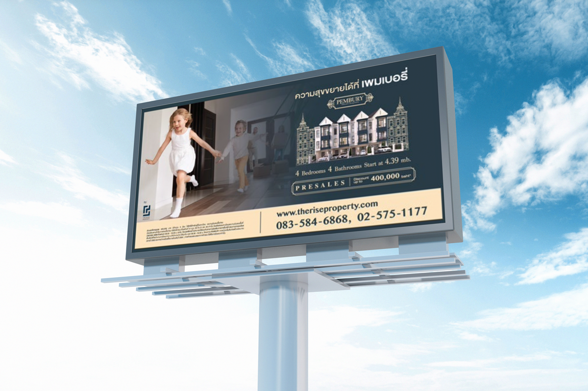

<!-- Main -->

    <!-- One -->
    <section id="one">
        

            <h1 class="text-color-main text-no-margin">My Portfolio</h1>
            <!-- 

                

                    

                        
                        

                            
John Doe

                        

                    

                

                

                    

                        
                        

                            
John Doe

                        

                    

                

            
 -->
        

    </section>

