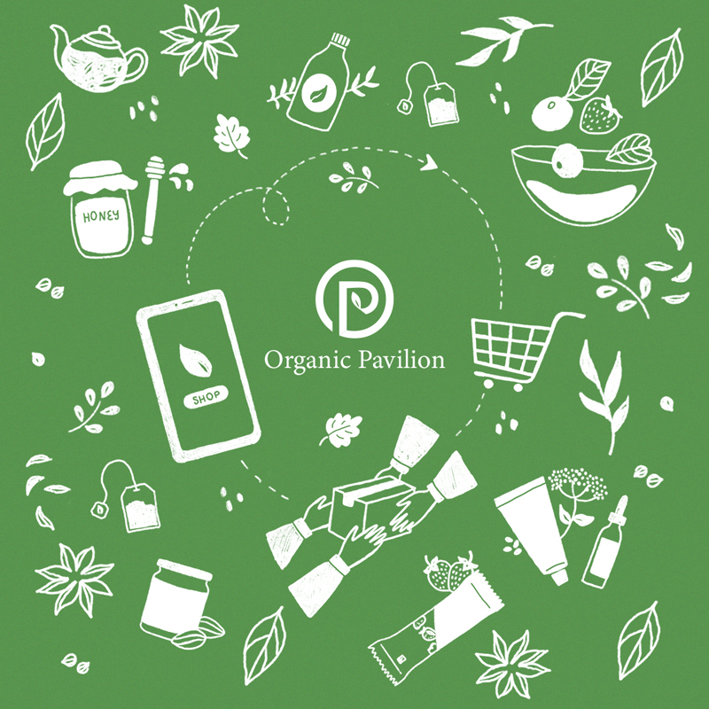

    <!-- One -->
    <section id="one">
        

            <h1 class="text-color-main text-no-margin">My Blog</h1>
             
             
            

                

                    

                        <a href="/todo-list-blog.html">
                        
                        
To-Do List เพิ่มประสิทธิภาพการทำงาน (Productive)

                        </a>
                    

                

                

                    

                        
                        
The Upgrade

                    

                

                

                    

                        
                        
Organic Pavilion

                    

                

            

        

    </section>

