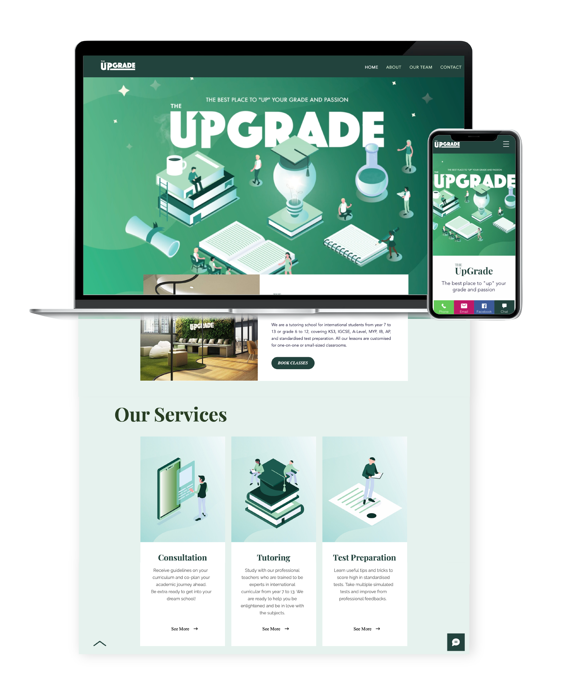
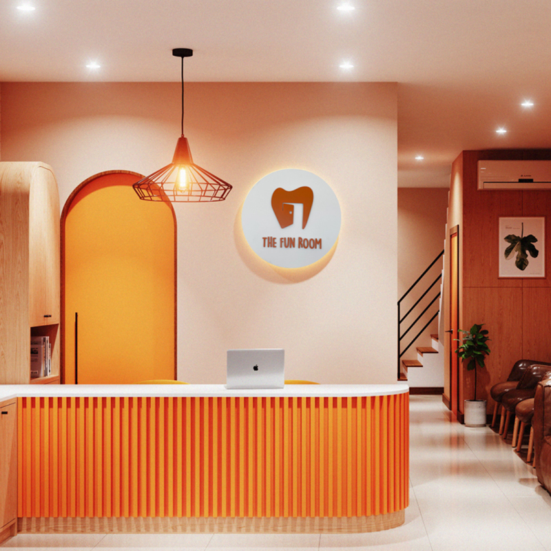
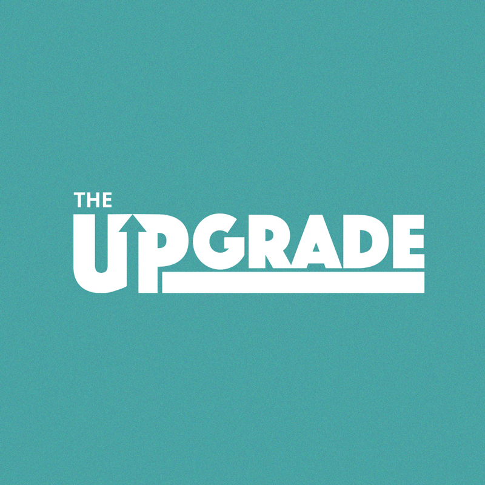
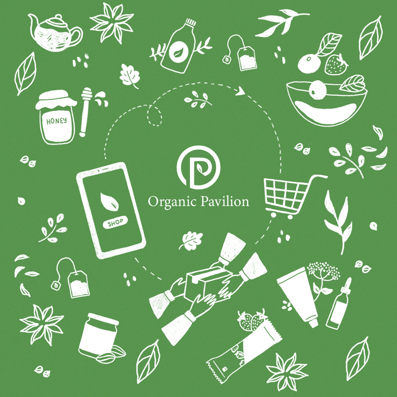

    <!-- One -->
    <section id="one">
        

            <h3 class="text-black text-no-margin no-font-weight">2019 Working at</h3>
            <h1 class="text-color-main text-no-margin text-line">The Upgrade</h1>
            <h3 class="text-black text-no-margin no-font-weight">Working on web design and development for The Upgrade tutoring school.</h3>
             
            

                
            

             
            <h3 class="text-color-main text-line">More Projects</h3>
            

                

                    

                        
                        
The Fun Room Clinic

                    

                

                

                    

                        
                        
The Upgrade

                    

                

                

                    

                        
                        
Organic Pavilion

                    

                

            

        

    </section>

